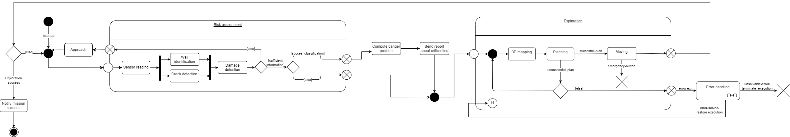
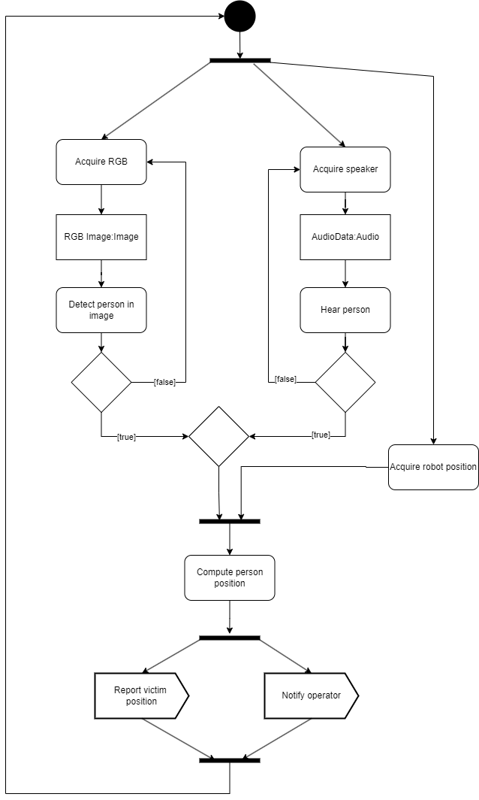
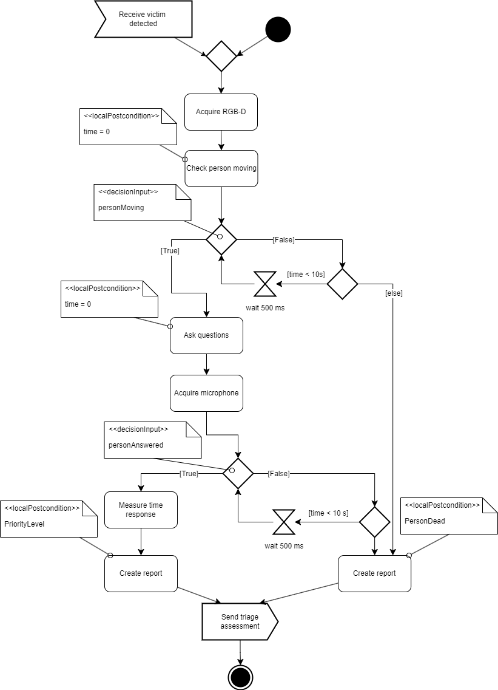

Behavioural diagram
======================

.. The Behavioral Diagram and its description for each mandatory component. The choice of behavioral diagram should be consistent with the type of component.

Structural Risk Assessment
-------------------------------

A state diagram was chosen to fully represent this task. This type of behavioral diagram allows us to clearly model how the different components are connected and exchange information as the robot's state changes ? from the initial configuration where the robot is simply powered on, to assessing the nearby environment, and finally to exploring the map until it is fully covered. Once the exploration is successfully completed, a success signal is sent. Each state is associated with specific actions and conditions that define how the robot navigates and responds to its environment.

Looking in more detail, the diagram highlights how this task can be logically divided into four main parts:

- **Approach**: Typically triggered after Risk Assessment if the information retrieved from the sensors is not sufficient to perform a wall evaluation. In this phase, the robot moves closer to better assess the structure.
- **Risk Assessment**: After collecting sensor data, the system performs  a structural identification (simplified as "wall detection") and a crack detection. Using this information, it then carries out a damage evaluation (Damage Detection), ultimately classifying the structure based on its risk level.
- **Danger Reporting**: If the wall classification identifies a dangerous structure, the position of the critical wall is computed and a report about the detected criticality is generated and sent.
- **Exploration**: The robot continues the 3D mapping of the environment, plans its next moves based on current data, and executes movement tasks.

This sequence is repeated iteratively until the environment is fully explored.

It is important to note that, in the implementation of our architecture, we assume that the robot is equipped with a dedicated motion control node responsible for managing movement within the environment. Therefore, we rely on this interface for handling motion commands. Similarly, we consider the presence of an emergency stop button, directly interfaced with the motion control node, which allows an on-site operator to immediately stop the robot in case of malfunction. In addition, an error handling block has been incorporated into the model: if a planning failure or unexpected event occurs, the system can manage these cases gracefully without causing fatal errors.

Victim detection and Reporting
-------------------------------

Since activity diagrams are particularly effective for modeling workflows with conditional logic, it was chosen to represent the behavior of the system across different scenarios. Victim Detection and Reporting task continuously monitors the environment using both the RGB-D camera and microphone, analyzing incoming data to detect signs of human presence. When a victim is detected, two signals are triggered:

- **Report victim position**: the estimated location of the detected person is published for use by the Triage System.
- **Notify operator**: an alert is sent to the operator, informing them of a potential victim in need of assistance and where to find.

The logical flow of the activity diagram is structured as follows:

- **Start**: The robot continuously subscribes to RGB-D image data, microphone input, and updates its current localization.
- **Analyze data**: The incoming image and audio streams are processed to determine whether a person has been detected visually or acoustically.
- **Detection event**: If either the camera or microphone detects a person:

    - A position estimate is generated based on the current robot location.
    - The detected victim position is published.
    - A service request is sent to report the victim detection to the operator and mission management systems.

The system then loops back and waits for new data from the sensors.

Triage system
----------------------

This chapter describes the behaviour of the **triage system** module, 
which is responsible for assessing a detected victim's consciousness, responsiveness, and critical condition.
An **Activity Diagram** was selected to model this behaviour because it provides a clear, 
intuitive way of representing sequential processes, decisions, and timing conditions. 
The process flow, as shown in the diagram, consists of the following key stages:

- **Start**: 
  The process begins with the detection of a victim (``victimDetected`` decision input).

- **Acquire RGB-D**: Once a victim is detected, the robot uses its RGB-D camera to acquire a depth and color image of the person.

- **Check Person Moving**:
  
  - If a victim is detected, the system checks if the person is moving (``personMoving`` decision input).
  - If the person is moving, the system proceeds to ask questions.
  - If the person is not moving: the system checks for movement at 500 ms intervals for a duration of up to 10 seconds. If no movement is detected within this time frame, the person is considered dead, and a report is generated.

- **Ask Questions**: After detecting movement (or after the initial wait period), the robot asks simple questions using its speakers.

- **Acquire Microphone**: After posing the questions, the robot activates its microphone to listen for any response from the victim.

- **Detect Answer**:

  - If the person answers (``personAnswered`` decision input): the robot measures the response time and assigns a **PriorityLevel** to the victim based on this duration. A report is then generated and sent to the human supervisor."
  
  - If the person does not answer: the robot checks for a response at 500 ms intervals for up to 10 seconds. If no answer is received within this time, the person is considered dead, and a report is generated.

- **End**: After assessing the victim and sending the triage report, the process terminates.

