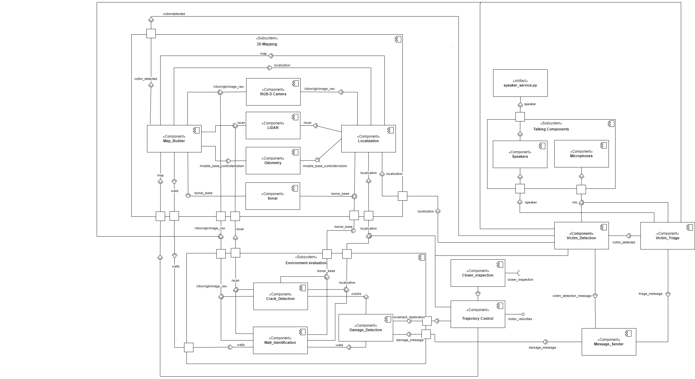

Component diagram
===================

 For each component list:
 -  their interfaces 
 -  describe them according to the component-based software architecture paradigm (i.e., stateless/statefull, data/service, strongly-typed/loosely-typed, etc).

This page provides an architectural component diagram. It is organized into three main subsystems:

- Structural Risk Assessment
- Victim Detection and Reporting
- Triage System

Structural Risk Assessment
-------------------------------
This subsystem focuses on detecting cracks and unstable areas through image processing and sensor fusion. It also evaluate the overall building's risk level. It consists of two core subsystem: 3D mapping and Environment evaluation.

3D Mapping
^^^^^^^^^^^^^^
The 3D Mapping subsystem allows the robot to create a map the surrounding environment and determine its localization using information from its sensors. The map built enables the trajectory control component to function correctly, allowing the robot to autonomously plan and adapt its route in response to newly detected obstacles or debris. Once the environment is fully explored, the system notify the human supervisor and awaits further instructions. 

The 3D Mapping subsystem is strictly linked to the Environment evaluation subsystem. Specifically:

- The Map_Builder component provides the spatial map.
- The Localization component provides the robot's real-time position inside the given map.

These interfaces are highly important since once a critical structure is found by the Environment subsystem, it can be uploaded into the map, allowing the future operator to have a broader vision of the environment conditions.

Sensor inputs are external to the system scope and are provided via ROS bag files. These include:

- RGB-D Camera
- LiDAR
- Sonar
- Odometry

Environment evaluation
^^^^^^^^^^^^^^^^^^^^^^^^
The environment evalutation subsystem uses the outputs from 3D Mapping to perform structural analysis. It is composed of three main components:

- **Wall_Identification**: Detects and categorizes walls and structural elements within the environment.
- **Crack_Detection**: Identifies fractures in walls and assesses their severity.
- **Damage_Detection**: Aggregates results from the Wall_Identification and Crack_Detection components to evaluate the overall structural integrity of the environment.

Both **Wall_Identification** and **Crack_Detection** could benefit from the application of the Strategy Design pattern. Since there are multiple possible algorithms for wall detection and crack assessment, this pattern enables selecting the most appropriate algorithm at runtime depending on available sensor data, environmental conditions, or system configuration. In fact, we can find from simple thresholding tecquinique to machine learning-based approaches, or depth analysis techniques,between the possible strategy applicable.

When the **Damage_Detection** component identifies a structurally dangerous wall, it generates a real-time critical report and sends it to the human supervisor. Upon receiving the alert, the supervisor can request a more detailed inspection of a specific area. If required, the robot can autonomously approach the area for a more precise assessment.

In addition, the **Trajectory_Control** component, responsible for planning and adjusting the robot's movements, could be effectively designed using the State pattern. The robot's navigation behavior needs to adapt dynamically based on its current situation. For example, it might need to transition between exploring the environment, avoiding newly detected obstacles, approaching points of interest for closer inspection, or responding to emergencies such as unstable structures or detected victims. The State pattern offers a clean and maintainable way to model these behavioral changes. As shown in the diagram, the Trajectory_Control component provides an interface to the motor controller, enabling the robot to execute the appropriate movements as needed.

Victim detection and Reporting
-------------------------------
The Victim Detection and Reporting subsystem is responsible for autonomously identifying potential victims within the environment. It uses RGB-D cameras and microphones to detect human presence, calculate their precise location, and immediately send a real-time alert to human rescuers.

Upon detection, the system triggers the Triage System to assess the victim's physical condition for rescue prioritization.

As for the **Wall_Identification** and **Crack_Detection**, the **Victim_Detection** component could benefit from the application of a Strategy Design pattern.

The **Victim_Detection** component could benefit from the application of the Strategy pattern, since different detection techniques may be used depending on the environmental conditions or sensor availability, allowing the system can dynamically select the most appropriate detection algorithm at runtime.

Triage system
----------------------
The Triage System subsystem activates once a victim is detected. It evaluates the victim's physical condition to effectively prioritize rescue operations and generate an assessment report. Using data collected from RGB-D cameras and microphones, the system analyzes key health indicators, including:

- Consciousness
- Responsiveness
- Severity of injuries

The Victim_Triage component would similarly benefit from the Strategy design pattern, as different triage assessment methods or criteria may be more appropriate depending on the situation. By applying the Strategy pattern, the system can flexibly select the most suitable evaluation approach without complicating the overall design.

Message_Sender
----------------
All three subsystems interface with the Message_Sender component - a service responsible for relaying alerts to the human operator. The type of alert sent depends on the source subsystem:

- Structural environment alarm (DamageReport)
- Victim detected alarm (VictimReport)
- Triage assessment completed (TriageReport)